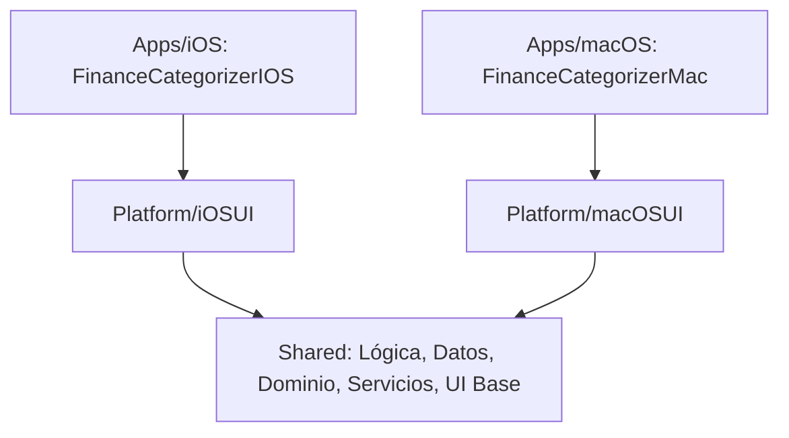

# Matriz de Módulos - FinanceCategorizer

Este documento define la modularidad del proyecto, la distribución de responsabilidades en el código compartido e independiente, y los objetivos de cobertura de pruebas por componente.

---

## 1. Arquitectura de Módulos

El proyecto está diseñado bajo un esquema multi-plataforma donde la lógica de negocio y persistencia se comparte a nivel de código fuente en la carpeta `Shared`, mientras que los puntos de entrada y componentes visuales específicos se encuentran en `Platform` y `Apps`.

---

## 2. Matriz de Distribución de Componentes

La siguiente matriz detalla cada componente, su ubicación física, plataforma de ejecución, dependencias y cobertura de pruebas asignada.

| Componente / Módulo | Directorio | Plataforma | Dependencias Clave | Objetivo de Cobertura | Tipo de Pruebas |
| :--- | :--- | :--- | :--- | :--- | :--- |
| **Punto de Entrada iOS** | `Apps/iOS/` | iOS | `Platform/iOSUI`, `Shared` | ~30% | Smoke tests, compilación |
| **Punto de Entrada macOS** | `Apps/macOS/` | macOS | `Platform/macOSUI`, `Shared` | ~30% | Smoke tests, compilación |
| **UI Específica iOS** | `Platform/iOSUI/` | iOS | `Shared` | ~50% | UI Tests iOS |
| **UI Específica macOS** | `Platform/macOSUI/` | macOS | `Shared` | ~50% | UI Tests macOS |
| **Sistema de Diseño Base**| `Shared/UI/` | Compartido | SwiftUI nativo | ~70% | Snapshot/Localization Tests |
| **Reglas e Importación** | `Shared/Services/` | Compartido | SwiftData, ZIPFoundation | ~85% | Unit tests intensivos (Fixtures) |
| **Modelos de Dominio** | `Shared/Domain/` | Compartido | - | ~95% | Unit tests unitarios de lógica pura |
| **Capa de Persistencia** | `Shared/Data/` | Compartido | SwiftData | ~80% | Integration tests con contenedores en memoria |
| **Integraciones de IA** | `Shared/AI/` | Compartido | FoundationModels API | ~90% | Unit tests con Mocks de API |

---

## 3. Estrategia de Pruebas Asociada

### Pruebas Unitarias (`FinanceCategorizerTests`)
- Target: `FinanceCategorizerTests` (iOS simulator platform).
- Enfoque: Validación estricta del motor de categorización, mappers de bancos (Openbank, otros), lógica del recomendador basado en CreateML y limpieza/normalización de textos.
- Ejecución local: `./scripts/test-fast.sh` o vía Xcode.

### Pruebas de Interfaz de Usuario (`UITests`)
- Targets diferenciados: `FinanceCategorizerUITestsIOS` y `FinanceCategorizerUITestsMac`.
- Enfoque: Validación de flujos críticos de usuario (importación de CSV, visualización de gráficos en el dashboard, creación manual de reglas de categorización).

### Control de Calidad de Datos
- Las pruebas usan fixtures locales anonimizados ubicados en `Tests/UnitTests/Fixtures/` para comprobar comportamientos reales de extractos bancarios sin exponer información real de producción.
