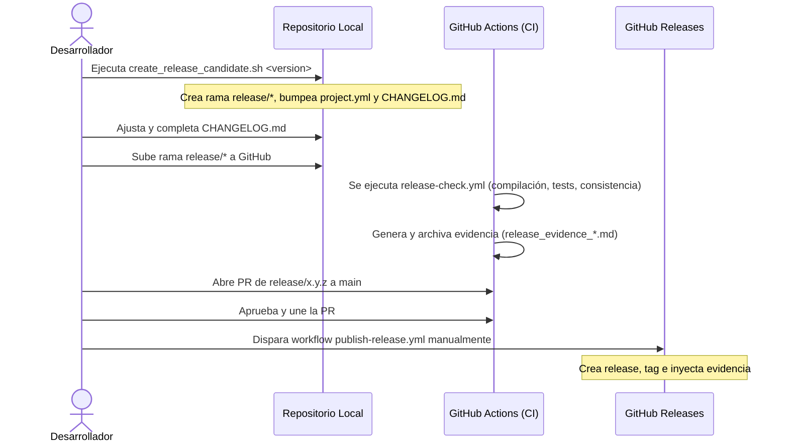

# Proceso de Release - FinanceCategorizer

Este documento describe paso a paso cómo preparar, verificar y desplegar una nueva versión de la aplicación.

---

## Flujo General de Lanzamiento



---

## Paso 1: Preparación del Release Candidate (RC)

1. Asegúrate de estar en la rama `main` y tener todos los cambios actualizados y limpios.
2. Ejecuta el script de preparación especificando la versión SemVer deseada:
   ```bash
   ./scripts/create_release_candidate.sh 0.3.0-alpha.1
   ```
3. El script automáticamente:
   - Creará y cambiará a la rama `release/0.3.0-alpha.1`.
   - Incrementará la versión (`MARKETING_VERSION`) y el número de compilación (`CURRENT_PROJECT_VERSION`) en `project.yml`.
   - Insertará una cabecera stub para la versión en `docs/CHANGELOG.md`.
   - Realizará un commit local con la actualización de versión.

4. Abre `docs/CHANGELOG.md` y completa los apartados `### Added`, `### Changed` y `### Fixed` correspondientes a esta versión.

---

## Paso 2: Verificación Local

Antes de subir los cambios, realiza una comprobación local rápida de consistencia y seguridad:

1. Ejecuta la validación de versiones:
   ```bash
   ./scripts/check_version_consistency.sh
   ```
2. Ejecuta el escáner de archivos sensibles para asegurar que no estás subiendo credenciales, bases de datos o logs privados:
   ```bash
   ./scripts/verify_no_sensitive_files.sh
   ```
3. Ejecuta los tests unitarios rápidos:
   ```bash
   ./scripts/test-fast.sh
   ```

---

## Paso 3: Subir Rama y Validar en Integración Continua (CI)

1. Sube la rama de release candidate a GitHub:
   ```bash
   git push origin release/0.3.0-alpha.1
   ```
2. Esto activará de forma automática el workflow `.github/workflows/release-check.yml`.
3. Revisa la ejecución en GitHub Actions:
   - Verificará la consistencia de versiones y archivos seguros.
   - Compilará la app para iOS y macOS de forma limpia.
   - Correrá toda la suite de tests unitarios y validación de claves localizables.
   - Generará un reporte de evidencias (`release_evidence_v0.3.0-alpha.1.md`) y lo guardará como un artifact descargable del run.

---

## Paso 4: Creación de Pull Request y Merge

1. Abre una Pull Request en GitHub de la rama `release/0.3.0-alpha.1` hacia `main`.
2. Una vez que todos los checks automáticos de la PR estén en verde (`pr-check.yml`), realiza el Merge.

---

## Paso 5: Publicación Manual de la Release

El tag de la versión **nunca se publica automáticamente**. Para realizar la publicación definitiva:

1. Ve a la pestaña **Actions** en el repositorio de GitHub.
2. Selecciona el workflow **Publish Release**.
3. Haz clic en **Run workflow**.
4. Selecciona la rama `main` y proporciona los parámetros requeridos (confirmar la versión a publicar).
5. El workflow ejecutará las últimas comprobaciones de sanidad, recopilará las evidencias definitivas y llamará a la API de GitHub para crear la **Release** de forma oficial, publicando el tag `v0.3.0-alpha.1` y adjuntando el reporte de evidencias.
