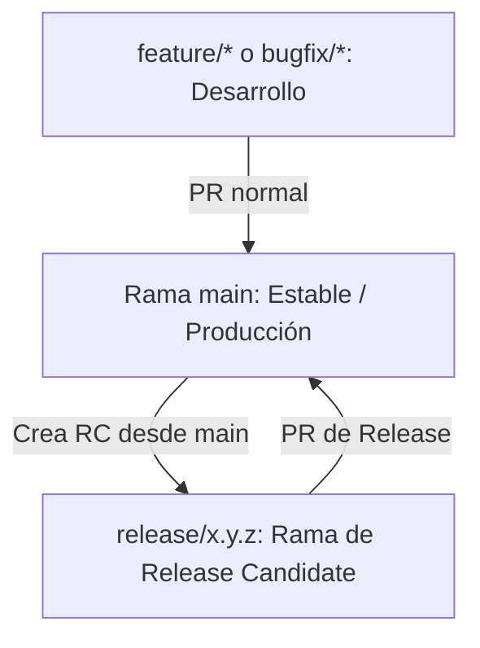

# Política de Versionado y Ramas - FinanceCategorizer

Este documento define las directrices y estándares para la nomenclatura de versiones, la estrategia de ramificación y la publicación de lanzamientos en el proyecto.

## 1. Versionado Semántico (SemVer)

Seguimos el estándar [SemVer 2.0.0](https://semver.org/lang/es/), estructurando las versiones de la siguiente manera:

$$\text{Versión} = \text{Mayor}.\text{Menor}.\text{Parche}[-\text{Pre-release}]$$

Ejemplos: `0.3.0`, `0.3.0-alpha.1`, `0.3.0-beta.2`

- **Mayor (Major):** Incremento por cambios incompatibles o estructurales (ej. reestructuración drástica de base de datos sin migración automática, rediseño completo del núcleo de persistencia).
- **Menor (Minor):** Incremento por nuevas funcionalidades compatibles con las anteriores (ej. soporte de nuevo banco, nuevo motor de insights).
- **Parche (Patch):** Incremento por corrección de errores (bug fixes) compatibles.
- **Pre-release (Pre-lanzamientos):** Sufijos indicativos del estado de madurez (`-alpha.X`, `-beta.X`).

---

## 2. Estrategia de Ramas (Git Flow Simplificado)

El ciclo de desarrollo y release se organiza en torno a las siguientes ramas principales y de soporte:

### `main`
- La rama de desarrollo y estabilidad principal.
- Todo desarrollo nuevo entra a `main` a través de Pull Requests desde ramas `feature/*` o `bugfix/*`.
- Siempre debe compilar y pasar todos los tests unitarios.

### `release/x.y.z` (Ramas de Release Candidate)
- Se bifurcan de `main` cuando se decide empaquetar una nueva versión.
- Nombre de la rama: `release/x.y.z` (ej. `release/0.3.0` o `release/0.3.0-alpha.1`).
- En esta rama se corrigen únicamente detalles de última hora, traducciones o ajustes finos.
- No se añaden nuevas funcionalidades.
- Una vez validada la versión, se fusiona de vuelta a `main` mediante una PR de release.

### `feature/*` y `bugfix/*`
- Ramas temporales creadas para el desarrollo de tareas específicas.
- Se fusionan a `main` tras la revisión de código y la aprobación de la integración continua (CI).

---

## 3. Criterios de Madurez de Versión

### Alpha (`-alpha.N`)
- **Público Objetivo:** Desarrolladores y testers internos.
- **Criterio de Entrada:** Compilación exitosa del proyecto, ejecución de tests unitarios en verde.
- **Estado de la App:** Funcionalidades base implementadas. Puede contener bugs menores no críticos, localizaciones incompletas o pantallas con pulido básico.

### Beta (`-beta.N`)
- **Público Objetivo:** Usuarios beta registrados (ej. vía TestFlight o builds específicos).
- **Criterio de Entrada:** Versión feature-complete (funcionalidades completas para esta versión), localización en inglés y español completa, y sin bloqueos o crashes críticos detectados en la fase Alpha.
- **Estado de la App:** Estable para uso diario estructurado. Se incluye telemetría y reportes de Crashlytics activos.

### Estable (Stable, final)
- **Público Objetivo:** Todo el público (App Store y Mac App Store).
- **Criterio de Entrada:** Aprobación del periodo Beta sin reportes de regresiones críticas ni pérdidas de datos, y con la validación de migración de base de datos exitosa.
- **Estado de la App:** Completamente pulida y lista para producción.

---

## 4. Política de Publicación de Tags y Releases

- **Sin Tags Automáticos:** Para mantener el control del historial, **ninguna acción de Git Push crea tags o releases automáticamente**.
- **Creación de RC:** Se realiza de forma local y controlada usando el script `./scripts/create_release_candidate.sh <version>`. Esto crea la rama `release/<version>` y bumpéa la versión de forma local.
- **Fase de Verificación:** Al subir la rama `release/*`, se activa el workflow `release-check.yml` que ejecuta los tests de integración y genera un reporte de evidencias (`release_evidence_v*.md`).
- **Lanzamiento Definitivo:** Una vez aprobado, un administrador ejecuta manualmente el workflow `publish-release.yml` a través del disparador manual (`workflow_dispatch`), el cual genera y publica la release de GitHub y el tag definitivo de manera formal y segura.
