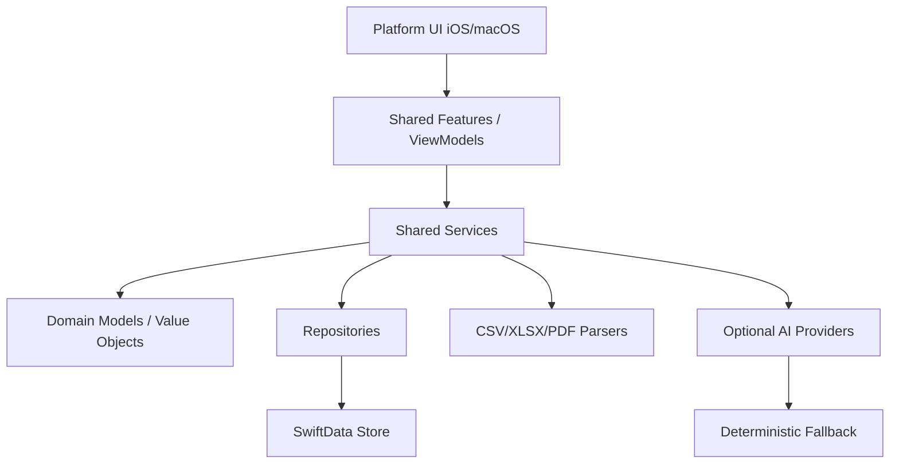

# Arquitectura objetivo

## Principios

- Dominio financiero independiente de UI y plataforma.
- Importacion reproducible con fixtures, diagnosticos y trazabilidad.
- Categorizacion conservadora: solo autoaceptar cuando la confianza sea alta.
- IA opcional: nunca debe ser requisito para importar, categorizar o revisar.
- Persistencia local segura: ninguna recuperacion automatica debe borrar datos sin backup.
- UI nativa por plataforma: `TabView` en iOS/iPadOS y `NavigationSplitView` en macOS.

## Capas recomendadas

## Limites de modulo

### `Apps/`

Solo entry points, scenes, environment injection y comandos de app.

### `Platform/`

Pantallas y componentes especificos de plataforma. No debe contener reglas de negocio ni parsing.

### `Shared/Features/`

View models y estado de flujos. Puede coordinar servicios, pero no debe duplicar algoritmos.

### `Shared/Services/`

Casos de uso y motores: importacion, normalizacion, categorizacion, aprendizaje, insights, exportacion.

### `Shared/Data/`

SwiftData, repositorios y DTOs de persistencia. Debe ocultar detalles de `ModelContext`.

### `Shared/Domain/`

Modelos de negocio, enums y value objects. Debe mantenerse lo mas estable posible.

### `Shared/AI/`

Integraciones AI, prompts y salidas estructuradas. Todo proveedor debe tener fallback determinista.

## Flujo principal de importacion

1. El usuario selecciona archivo.
2. `FileImportService` valida acceso, formato y fingerprint.
3. Parser especifico genera `ImportPreviewResult`.
4. `ImportValidationService` decide si es importable o requiere mapeo manual.
5. `TransactionNormalizer` genera DTO normalizado y fingerprints por fila.
6. `TransactionRepository` descarta duplicados.
7. `CategorizationOrchestrator` clasifica o manda a revision.
8. `ImportBatchRepository` guarda trazabilidad del lote.
9. `InsightEngine` refresca insights derivados.
10. UI muestra resumen y cola de revision.

## Politica de persistencia

La store SwiftData debe tratarse como activo financiero del usuario.

Requisitos:

- Backup automatico antes de migraciones o recuperacion.
- Export diagnostico cuando falle apertura.
- Nunca borrar store persistente sin crear copia recuperable.
- Migraciones versionadas al cambiar modelos.
- Tests de apertura de store con esquema anterior cuando haya cambios de modelo.

## Politica de AI

La IA puede sugerir, resumir o explicar. No debe ser fuente unica de verdad.

Requisitos:

- Feature flag por capacidad.
- Availability checks por plataforma/version.
- Output estructurado y validado.
- Confianza limitada por `ConfidenceScorer`.
- Fallback determinista visible y util.
- Registro de origen de decision: regla, memoria, ML local, AI o desconocido.
